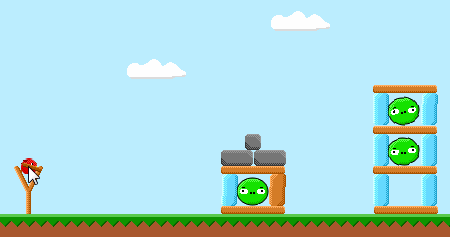

During a recent interview, I was presented with a compelling challenge: to create a visualizer for Projectile Motion. The assignment required implementing a tool capable of depicting the trajectory, maximum height, and distance traveled by a projectile based on its initial velocity and launch angle. In this post, I'll walk you through my approach and key takeaways from tackling this intriguing task.

---

## Unraveling the Physics and Mathematics

I started by doing some research on Projectile Motion. That's will be the first step in any task you are given. You need to understand the problem you are trying to solve. In this case, I needed to understand what Projectile Motion is and how it works.

### What is Projectile Motion?

According to [Wikipedia](https://en.wikipedia.org/wiki/Projectile_motion):

> Projectile motion is a form of motion experienced by an object or particle (a projectile) that is projected near the Earth's surface and moves along a curved path under the action of gravity only (in particular, the effects of air resistance are assumed to be negligible).

Projectile Motion is a common phenomenon in physics, mathematics, and even game development, as exemplified in games like Angry Birds. The trajectory of the bird in Angry Birds, for instance, is determined using the principles of Projectile Motion.



Did you see the trajectory of the bird? That's Projectile Motion.

### The Mathematics Behind Projectile Motion

Calculating the trajectory of a projectile is not that hard. You just need to know the initial velocity and angle. Then you can calculate the position of the projectile at any given time.

We will use 2D coordinates to represent the position of the projectile. The X coordinate will represent the horizontal position and the Y coordinate will represent the vertical position.

The initial velocity is the speed at which the projectile is launched. The angle is the angle at which the projectile is launched in radians.

The formula for calculating the position of the projectile at any given time is:

$$
x = v_0 \cos(\theta) t
$$

$$
y = v_0 \sin(\theta) t - \frac{1}{2} g t^2
$$

Where $x$ is the horizontal position, $y$ is the vertical position, $v_0$ is the initial velocity, $\theta$ is the angle, $t$ is the time, and $g$ is the gravitational acceleration (9.8 m/s²).

### Calculating the Maximum Height, Distance Traveled, and Time of Flight

Maximum height is the highest point the projectile reaches. while distance traveled is the horizontal distance the projectile travels before hitting the ground. and time of flight is the time it takes for the projectile to hit the ground.

The formula for calculating the maximum height is:

$$
y_{max} = \frac{v_0^2 \sin^2(\theta)}{2g}
$$

while the formula for calculating the distance traveled is:

$$
d = \frac{v_0^2 \sin(2\theta)}{g}
$$

and time of flight is:

$$
t_{flight} = \frac{2v_0 \sin(\theta)}{g}
$$

Now that we know how Projectile Motion works, let's see how we can implement it in JavaScript.

## Translating Mathematics to Code

We will start by defining a constant for the gravitational acceleration:

```js
const GRAVITY = 9.8
```

Then I formulated functions for calculating flight time, maximum height, and distance:

```js
function getFlightTime(v, angle) {
  return (2 * v * Math.sin(angle)) / GRAVITY
}

function getMaxHeight(v, angle) {
  return Math.pow(v * Math.sin(angle), 2) / (2 * GRAVITY)
}

function getDistance(v, angle) {
  return (Math.pow(v, 2) / GRAVITY) * Math.sin(angle * 2)
}
```

Now we can define a function for calculating the position of the projectile at any given time:

```js
function getPosition(v, angle, time) {
  return {
    x: v * time * Math.cos(angle),
    y: v * time * Math.sin(angle) - (GRAVITY * Math.pow(time, 2)) / 2
  }
}
```

To accommodate radian-based calculations, a conversion function was introduced:

```js
function toRadians(degrees) {
  return (degrees * Math.PI) / 180
}
```

Now we are pretty much done with the math part. Now let's see how we can visualize the trajectory of the projectile.

## Visualization

We will use [Canvas API](https://developer.mozilla.org/en-US/docs/Web/API/Canvas_API) to draw the trajectory of the projectile. We will create a canvas element and draw the trajectory on it.

```html
<canvas id="canvas"></canvas>
```

Then we will get the canvas element and its context:

```js
const canvas = document.getElementById('canvas')
const ctx = canvas.getContext('2d')
```

Also we need to get the initial velocity and angle from the user. Let's use prompts for now, though we will use a form later on and style it with CSS.

```js
const initialVelocity = parseFloat(prompt('Enter initial velocity:'))
const angle = toRadians(parseFloat(prompt('Enter angle in degrees:')))
```

Now we need to calculate the maximum height, distance traveled, and time of flight:

```js
console.log('Maximum height:', getMaxHeight(initialVelocity, angle))
console.log('Distance traveled:', getDistance(initialVelocity, angle))
console.log('Time of flight:', getFlightTime(initialVelocity, angle))
```

Then we need to draw the trajectory of the projectile. We will use the `getPosition` function to calculate the position of the projectile at any given time. Then we will create a function for drawing the projectile on the canvas:

```js
function drawProjectile(x, y) {
  ctx.beginPath()
  ctx.arc(x, y, 5, 0, Math.PI * 2)
  ctx.fill()
}
```

Now we can draw the trajectory of the projectile:

```js
let time = 0

while (true) {
  const position = getPosition(initialVelocity, angle, time)

  drawProjectile(position.x, position.y)
  time += 0.1 // time step of 0.1 seconds

  if (position.y < 0) {
    break
  }
}
```

Let's break down the code above. We start by setting the time to 0. Then we enter an infinite loop. In each iteration of the loop, we calculate the position of the projectile at the current time. Then we draw the projectile on the canvas. Then we increase the time by 0.1 seconds. Finally, we check if the projectile has reached the ground. If it has, we break out of the loop.

Now we can run the code and see the trajectory of the projectile (I have added some CSS to make it look better):

<iframe height="500" style="width: 100%;" scrolling="no" title="Projectile Motion Visualizer" src="https://codepen.io/abdelrhmansaid/embed/OJvVjMR?default-tab=html%2Cresult" frameborder="no" loading="lazy" allowtransparency="true" allowfullscreen="true">
  See the Pen <a href="https://codepen.io/abdelrhmansaid/pen/OJvVjMR">
  Projectile Motion Visualizer</a> by Abdelrhman Said (<a href="https://codepen.io/abdelrhmansaid">@abdelrhmansaid</a>)
  on <a href="https://codepen.io">CodePen</a>.
</iframe>

As you can see, the trajectory of the projectile is drawn on the canvas. The trajectory is drawn using a series of dots. Each dot represents the position of the projectile at a given time, and here we can finally feel good about ourselves 😂.

## Conclusion: A Journey of Learning

This task proved to be a captivating exploration into the realms of physics, mathematics, and JavaScript implementation. By unraveling the intricacies of Projectile Motion, I gained valuable insights. I hope this journey through the task and its solution proves enlightening. Feel free to share your thoughts or questions with me on Twitter [@AbdelrhmanSWE](https://twitter.com/AbdelrhmanSWE).

Thanks for accompanying me on this coding adventure! 🚀
